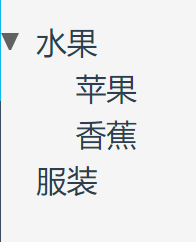
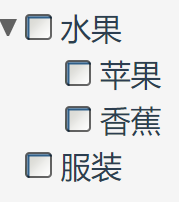
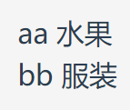

# zzTree使用

[toc]

---

## TODO

1. 图标样式需要调整（使用正确的精灵图）

2. 添加参数配置，完善功能

---

## 组件说明

### 为什么开发这个组件

使用 AntDesign 的树组件 [tree](https://www.antdv.com/components/tree-cn/) 在使用时存在一个问题： 当同时更改很多个节点的状态时（例如，勾选某个父节点造成数量在4位数以上的子节点同时被勾选上）组件存在明显的卡顿问题

### 组件优点

1. 解决了页面多个节点状态更改时卡顿的问题
借鉴了 [zTree](http://www.treejs.cn/v3/main.php#_zTreeInfo) 的代码，更改DOM的样式时直接操作DOM，加快了浏览器页面渲染的过程。实际上节点太多时也会出现卡顿的情况，但影响不大

zTree中使用了 `background-image` 和 `background-position` 配合精灵图实现了图标样式的改变（例如，勾选状态、半勾选状态、未勾选状态等）。经测试，这种方式比使用CSS中的伪类来生成具体的图标样式在页面渲染方面更加高效

### 组件缺点

1. **DOM操作** 和 **数据处理** 分开处理，造成代码量增加，相当于摒弃了 `VUE` 的优势

2. 目前只支持基础功能，`AntDesign` 的树组件中的全部功能未全部支持，需要持续添加

---

## 组件使用示例

### 基础使用<div id="basic_demo"></div>

```vue
<template>
  <div>
    <zzTree :treeData="treeData" />
  </div>
</template>
<script>

// 使用自己的路径
import zzTree from '@/components/zzTree/zzTree.js'

export default {
  name: "demo",
  components: {
    zzTree
  },
  data() {
    return {
      treeData: [
        {
          name: '水果',
          id: '1',
          children: [
            {
              name: '苹果',
              id: '1-1'
            },
            {
              name: '香蕉',
              id: '1-2'
            }
          ]
        },
        {
          name: '服装',
          id: '2'
        }
      ]
    };
  }
};
</script>
```



### 复选框

```vue
<zzTree :treeData="treeData"
        :config="config" />

config: {
    checkable: true
}
```

#### 节点勾选/取消勾选时，父子节点联动关系

<a href="#config_checkRelation">参数说明</a>

```vue
config: {
    checkable: true,
    checkRelation: {
        Y: 'parent,children',
        N: 'parent,children'
    }
}
```



<div id="config_replaceFields"></div>

### 调整数据中的属性名称

```vue
pconfig: {
    replaceFields: {
        name: 'title',
        id: 'key',
        children: 'subItems'
    }
},
treeData: [
    {
        title: '水果',
        key: '1',
        subItems: [
        {
            title: '苹果',
            key: '1-1'
        },
        {
            title: '香蕉',
            key: '1-2'
        }
        ]
    },
    {
        title: '服装',
        key: '2'
    }
]
```

### 默认展开全部节点

```vue
config: {
    defaultExpandAll: true
}
```

### 异步加载

`config` 中的 `async` 和 `asyncCallback` 需要和`treeData`中各个节点的`isLeafNode`配合使用 <div id="treeData_isLeafNode"></div>

```vue
config: {
    async: true,
    asyncCallback: (nodeId) => {
        console.log(nodeId); // 节点ID值
        return new Promise(resolve => {
            // 此处可以发起请求获取数据
            setTimeout(() => {
                const data = [
                    {
                        name: '苹果',
                        id: '1-1'
                    }
                ]
                resolve(data)
            }, 2000)
        })
    }
},
treeData: [
    {
        name: '水果',
        id: '1',
        isLeafNode: false
    },
    {
        name: '服装',
        id: '2',
        isLeafNode: true
    }
]
```

### 自定义节点图标

```vue
<zzTree :treeData="treeData">
    <div slot="myIcon"><div>aa</div></div>
    <div slot="myIcon1"><div>bb</div></div>
</zzTree>

treeData: [
    {
        name: '水果',
        id: '1',
        iconSlotName: 'myIcon'
    },
    {
        name: '服装',
        id: '2',
        iconSlotName: 'myIcon1'
    }
]
```



#### 兼容公共组件comOrgTree的功能

<div id="config_iconParamName"></div>

```vue
config: {
    iconParamName: 'dwType'
},
treeData: [
    {
        name: '1',
        id: '1',
        dwType: '1',
        children: [
        {
            name: '1-1',
            id: '1-1',
            dwType: 'A',
            children: [
            {
                name: '1-1-1',
                id: '1-2',
                dwType: '2'
            }
            ]
        }
        ]
    }
]
```


---

## 参数说明

| 参数名   | 类型          | 说明     |
|----------|---------------|----------|
| treeData | Array\<Object> | 树的数据 <a href="#basic_demo">示例</a> |
| config   | Object        | 树的配置 |

### treeData

#### treeData[n].isLeafNode

<a href="#treeData_isLeafNode">示例</a>

    为false时表示当前节点有子节点，首次展开本节点时需要异步查询子节点信息

类型： `Boolean`
默认值： 无，即 `config.async` 为 `false` 时该参数无意义

### config

默认值：
```
{
    defaultExpandAll: false,
    iconParamName: 'dwType',
    checkable: false,
    replaceFields: {
        name: 'name',
        id: 'id',
        children: 'children'
    },
    checkRelation: {
        Y: 'parent,children',
        N: 'parent,children'
    },
    async: false
}
```

#### config.async

<a href="#treeData_isLeafNode">示例</a>

    是否异步查询子节点
    首次点击节点的展开图标时，查询该节点的子节点信息并添加到该节点上

类型： `Boolean`
默认值： `false`

配合 `config.asyncCallback` 和 `treeData`中每个节点的 `isLeafNode` 属性使用


#### config.asyncCallback

    config.async 为 true 时，首次点击节点的展开图标时进行的操作。
    用于异步查询节点的子节点信息
    需要返回Promise对象

类型： `Function`
默认值： `() => {}`

配合 `config.async` 和 `treeData`中每个节点的 `isLeafNode` 属性使用
**需要返回Promise对象**

#### config.checkable

    是否显示复选框

类型： `Boolean`
默认值： `false`

#### config.checkRelation

<div id="config_checkRelation"></div>

    存在复选框时，父子节点勾选联动(参考了zTree)

类型： `Object`
默认值：
```
{
    Y: 'parent,children',
    N: 'parent,children'
}
```

`Y` 表示 **勾选** 的情况， `N` 表示 **取消勾选** 的情况

以 `checkRelation.Y` 为例
1. 空字符串表示各个节点在勾选时是独立的，不影响父节点也不影响子节点
2. `child` 表示节点勾选时影响子节点的勾选情况，即勾选本节点后，所有的子节点都勾选上；不影响父节点的勾选情况
3. `parent` 表示节点勾选时影响所有父节点的勾选情况，不影响子节点的勾选情况
4. `parent,children` 表示节点勾选时影响所有的父子节点

#### config.defaultExpandAll

    树在生成的时候是否展开全部节点

类型： `Boolean`
默认值： `false`

#### config.iconParamName

<a href="#config_iconParamName">示例</a>

    兼容ComOrgTree中的功能
    项目使用过程中，公司的组织结构树是经常用到的树结构。这个树结构中节点的图标显示根据数据中的 dwType 来确定，dwType 的值有 1/A/2 三种情况，分别对应具体的三个图标。

类型： `String`
默认值： `dwType`


#### config.replaceFields

<a href="#config_replaceFields">示例</a>

    替换数据中的参数名称

类型： `Object`
默认值：
```
{
    name: 'name',
    id: 'id',
    children: 'children'
}
```

## 事件说明

全部事件
```
<zzTree :treeData="treeData"
        @nodeCheck="nodeCheck"
        @nodeExpand="nodeExpand"
        @nodeExpandAsync="nodeExpandAsync"
        @nodeSelect="nodeSelect"
        />

methods: {
    nodeCheck(checkedKeys, {checked, checkedNodes, node}){},
    nodeSelect(nodeId, {selected, node}){},
    nodeExpand(nodeId, {expanded, node}){},
    nodeExpandAsync(nodeId, node){}
}
```

### nodeCheck

    树节点勾选/取消勾选事件

`nodeCheck(checkedKeys, {checked, checkedNodes, node, event}){}`

| 参数名       | 类型           | 说明                     |
| ---          | ---            | ---                      |
| checkedKeys  | Array<String>  | 勾选状态的节点ID的数组   |
| checked      | Boolean        | 当前操作的节点是否勾选   |
| checkedNodes | Array\<Object> | 勾选状态的节点信息的数组 |

### nodeExpand

    config.async为false时， 树节点展开/收起事件

`nodeExpand(nodeId, {expanded, node}){}`

| 参数名   | 类型    | 说明         |
| ---      | ---     | ---          |
| nodeId   | String  | 节点ID       |
| expanded | Boolean | 节点是否展开 |
| node     | Object  | 节点信息     |

### nodeExpandAsync

    config.async为true时， 树节点首次展开事件
    子节点信息查询回来之后，再次展开或者收起节点，触发 nodeExpand 事件

`nodeExpandAsync(nodeId, node){}`

| 参数名   | 类型    | 说明         |
| ---      | ---     | ---          |
| nodeId   | String  | 节点ID       |
| node     | Object  | 节点信息     |

### nodeSelect

    节点选中/取消选中事件（点击节点的汉字）
    目前暂不支持同时选中多个节点，如果需要，请使用勾选功能 config.checkable = true

`nodeSelect(nodeId, {selected, node}){}`

| 参数名   | 类型    | 说明                   |
| ---      | ---     | ---                    |
| nodeId   | String  | 节点ID                 |
| selected | Boolean | 当前操作的节点是否选中 |
| node     | Object  | 节点信息               |